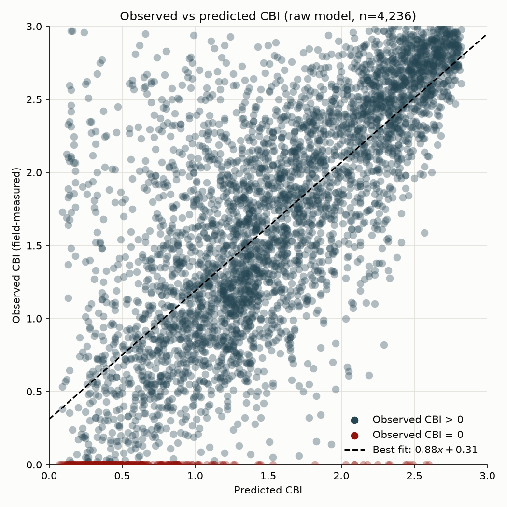
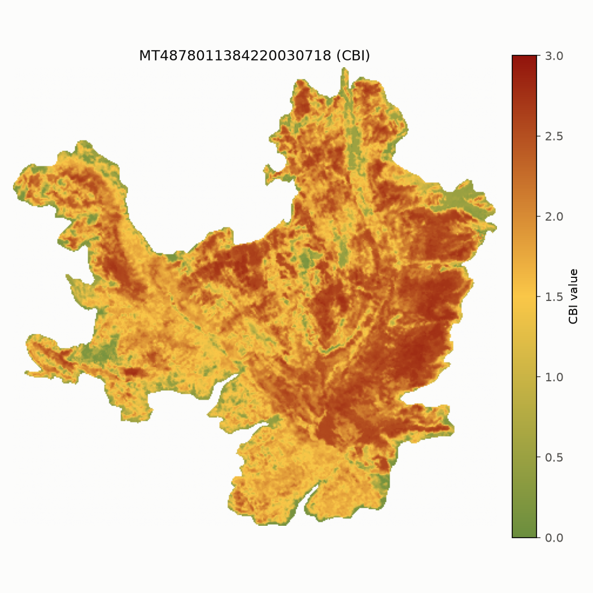
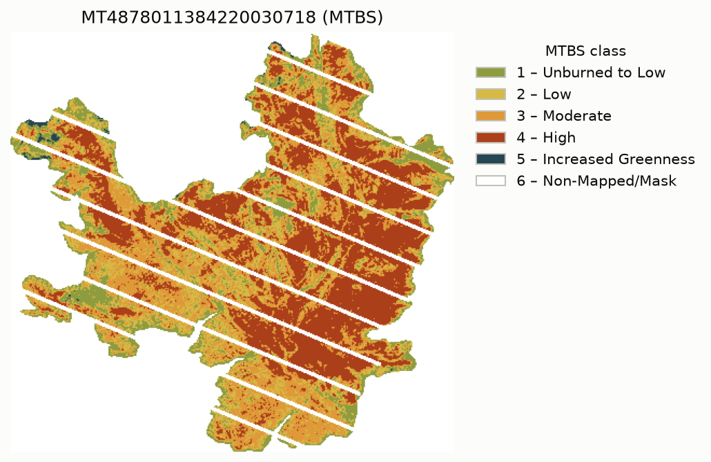
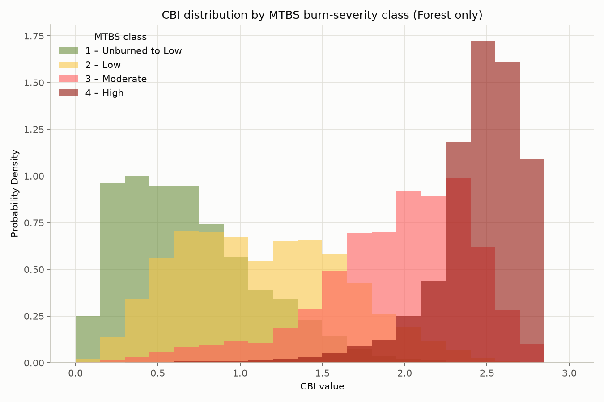
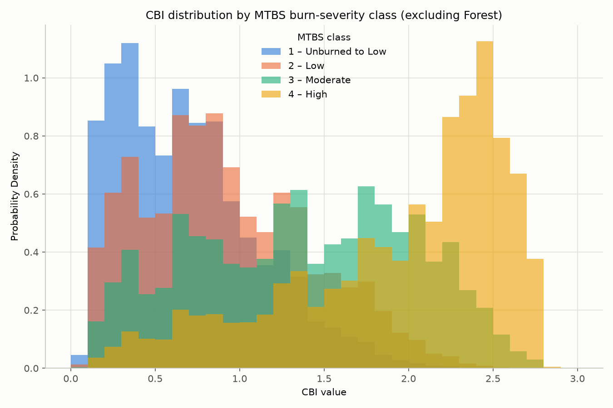

# CBI for CONUS

Compute Composite Burn Index (`CBI`) and bias-corrected CBI (`CBI_bc`) for MTBS fire perimeters, output as GeoTIFFs on the **EPSG:5070** grid (snapped to the NLCD grid), clipped to the perimeter.

Method: Parks et al. (2019), *Remote Sensing* 11, 1735 — a Random Forest of Landsat spectral indices + climatic water deficit + latitude.

## What's included
```
scripts/
├── oneshot.py - The original oneshot file provided by Fred Bunt.
├── aws_oneshot.py - The oneshot script modified for use on AWS EC2, also by Fred.
├── aws_threaded.py - Multithreaded, AWS-compatible.
├── perimeter_threaded.py - Multithreaded, pulls from Planetary Computer.
├── aws_utils.py - A collection of functions for running on AWS.
├── utils.py - A collection of commonly used functions.
├── data_analysis/ - LLM generated plotting & analysis utilities
└── legacy/
    ├── cbi_yearly.py - Uses the perimeter method for each state in a given year.
    ├── cbi_statewide.py - Preemptively caches the entire state.
    ├── cbi_statewide_threaded.py - Same functionality with multithreading.
    ├── cbi_perimeter.py - Caches each fire as it appears in the list.
    └── cbi_perimeter_aws.py - Single-threaded, no caching, AWS-compatible.
```

- `pyproject.toml` + `uv.lock` — the [uv] project definition (deps + pinned lock).
- `parks_2019/data/data_for_ee_model.csv` — RF training table (the model is
  trained from this on first run and cached to `data/model/cbi_rf.joblib`).
- `data/terraclimate/def_19812010_annual.tif` — the static climatic-water-deficit
  input (so it isn't re-downloaded).
- `data/fire_perims/` — Fire perimeters saved as GeoPackage (.gpkg) files. Too
large to put on github.

## Download & run

Install `uv` if you don't have it (see [https://docs.astral.sh/uv/](https://docs.astral.sh/uv/)). Then, from this directory:

clone the repository

```bash
git clone https://github.com/KaelanC-TechPriest/Compute-CBI
cd Compute-CBI/
```

and run the desired script

```bash
uv run python scripts/[desired script] ...
```

1. uv reads `pyproject.toml`/`uv.lock`, creates a local `.venv`, installs the
   pinned deps (Python 3.12), and runs — no manual environment step.
2. First run trains + caches the model (~15 s); later runs reuse it.
3. Data is downloaded from Planetary Computer or AWS depending on the script.
4. Outputs predicted CBI values to `out/` as defined by `--out-dir`.

> [!NOTE]
> **Needs internet.**
>
> The scripts that use Planetary Computer need internet access to be able to
> reach the landsat data source.

> [!NOTE]
> **AWS scripts need credentials.**
>
> The scripts that run on AWS require AWS credentials to download landsat data
> from an S3 bucket. You can set credentials with `aws configure`, creating
> access keys, or assigning a IAM role to your EC2 instance.

The AWS instance used to build the dataset was created using [terraform](https://developer.hashicorp.com/terraform) and [this](docs/main.tf) configuration. Please note, this instance does cost a decent amount of money to run continuously. The scripts will work on smaller instances.

## Examples

### Example 1: A forested Idaho 2016 wildfire

Event_ID: `ID4634811469320160718`, ~21 km².

```bash
uv run python scripts/oneshot.py \
  --gpkg data/fire_perims/test.gpkg \
  --event-id ID4634811469320160718 \
  --out-dir out
```

Expected console summary ($\approx 80$ Landsat scenes fetched; takes a few minutes):

```
fire=ID4634811469320160718 state=ID year=2016 DOY=[152,258]
landsat: 80 scenes, grid 422x394 EPSG:32611
out: grid=286x253 crs=EPSG:5070 valid_px=23089 CBI med=1.82 max=2.78
```

Writes `out/ID4634811469320160718_CBI.tif` and `out/ID4634811469320160718_CBI_bc.tif`
(EPSG:5070, 30 m, clipped to the perimeter). The moderate-to-high CBI (median ~1.8)
is the expected signal for a real forested wildfire.

### Example 2: All fires in Montana

Process every MTBS wildfire perimeter whose `Event_ID` starts with `MT`
(multithreaded AWS Landsat fetch). Outputs land under `data/cbi/MT/<year>/`.

```bash
uv run python scripts/aws_threaded.py \
  --gpkg data/fire_perims/mtbs/mtbs_perims_trimmed.gpkg \
  --state MT \
  --out-dir data/cbi/MT \
  --workers 4
```

- `--state` accepts a comma-separated list (e.g. `MT,ID,WY`).
- Existing `*_CBI.tif` / `*_CBI_bc.tif` pairs are skipped.
- Large perimeters are split automatically so each worker stays within RAM limits.

### Example 3: All fires in 2000

Same script, restricted to ignition year 2000 (CONUS-wide unless `--state` is also set).
Each fire is written under `--out-dir/<year>/`, e.g. `data/cbi/2000/<Event_ID>_CBI.tif`.

```bash
uv run python scripts/aws_threaded.py \
  --gpkg data/fire_perims/mtbs/mtbs_perims_trimmed.gpkg \
  --start-year 2000 \
  --end-year 2000 \
  --out-dir data/cbi \
  --workers 4
```

Use `--start-year` / `--end-year` together for any inclusive range (bounds: 1986–present (kind of)).
Combine with `--state` when you only want one (or a few) states in that window.

## Output

The raw (non-bias-corrected) output has been verified to be positively correlated with measured CBI. The plot below shows the correlation between predicted and measured CBI.

<p align="center">
  
</p>

The predictions are well correlated (RMSE = 0.590, Pearson $r = 0.738$, $R^2 = 0.544$). The red points are presumed to be pathological.

Parks et al.'s method composites the two years previous and following the fire which mitigates "stripping" from satellites and obscured data from cloud cover. Below is a visual example from a fire in Montana in 2003 (Fire ID: MT4878011384220030718).

<p align="center">
  
  &nbsp;
  
</p>

## Caveats

The scripts do not filter for NLCD classes at this time. This means that the data must be filtered after the fact for only forested pixels. The model will make predictions for non-forested pixels, but it is less accurate. The two plots below show the distributions of CBI pixels for a given MTBS class. Notice that the plot of non-forested pixels shows some pathologies which the forested-only plot does not.

<p align="center">
  
  &nbsp;
  
</p>

- Lacks a non-processing-area-mask, so bodies of water will be given a CBI number.
- Not all fires are complete, like the fire `TX3417209989919910222`, which has 89% of its area as missing data.
- Selecting a perimeter by `--index`/`--event-id` runs it regardless of fire type;
  the default-first-wildfire behavior only applies when neither is given.
- The `aws_threaded.py` script spawns `workers × 4 × 4` threads total.
    - 4 threads per fire perimeter or perimeter slice
    - 4 threads per piece (for parallelized band downloads)
    - In practice, this led to ~80 threads.

